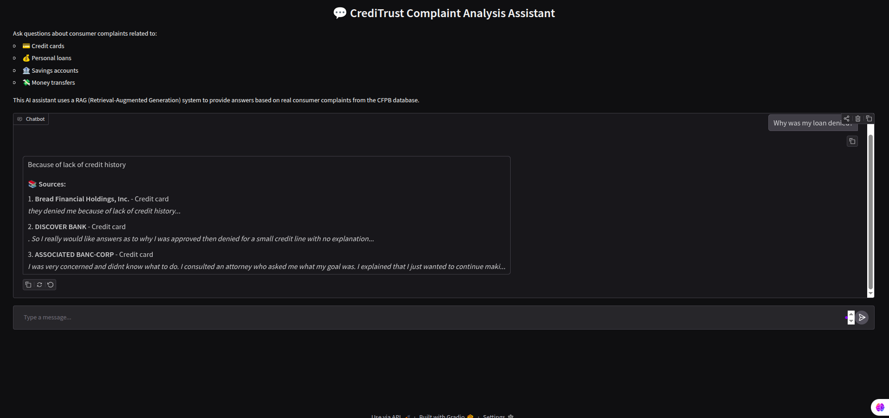

# Intelligent Complaint Analysis for Financial Services

A Retrieval-Augmented Generation (RAG) system for analyzing consumer financial complaints using CFPB data.

## 🎯 Project Overview

This project implements an end-to-end RAG pipeline to help financial institutions understand and respond to consumer complaints. The system:
- Processes 500K+ consumer complaints from CFPB
- Uses semantic search to find relevant complaint narratives
- Generates contextual answers using LLMs
- Provides an interactive chat interface

## 📊 Key Features

- **Data Processing**: Automated EDA, cleaning, and sampling
- **Vector Search**: FAISS-based semantic search with 40K+ embeddings
- **LLM Integration**: Google Flan-T5 for answer generation
- **Interactive UI**: Gradio chat interface
- **Source Attribution**: Displays relevant complaint sources
- **Logging**: Tracks all user interactions for analysis

## 🏗️ Architecture

```
User Query → Embedding → FAISS Search → Context Retrieval → LLM → Answer + Sources
```

## 📁 Project Structure

```
.
├── data/                    # Data files (gitignored)
│   ├── raw/                # Original CFPB dataset
│   └── processed/          # Filtered and sampled data
├── notebooks/               # Jupyter notebooks for each task
│   ├── task_1_eda.ipynb
│   ├── task_2_chunking_embedding.ipynb
│   └── task_3_rag_evaluation.ipynb
├── src/
│   ├── data_preprocessing.py   # Task 1: Data cleaning
│   ├── eda_analysis.py         # Task 1: EDA
│   ├── sampling.py             # Task 2: Stratified sampling
│   ├── chunking.py             # Task 2: Text chunking
│   ├── embedding.py            # Task 2: Embedding generation
│   ├── vector_store_builder.py # Task 2: FAISS index
│   └── rag/                    # RAG pipeline modules
│       ├── retriever.py        # Semantic search
│       ├── generator.py        # LLM answer generation
│       └── pipeline.py         # End-to-end RAG system
├── scripts/
│   ├── download_model.py       # Download LLM model
│   ├── generate_report.py      # Generate evaluation report
│   └── run_rag_evaluation.py   # Run RAG evaluation
├── report/                     # Generated reports and images
│   ├── images/                 # Visualizations
│   ├── stats/                  # Statistics
│   └── rag_evaluation.md       # RAG quality evaluation
├── logs/                       # Chat interaction logs (gitignored)
├── vector_store/               # FAISS index (gitignored)
├── app.py                      # Main Gradio application
└── requirements.txt
```

## 🚀 Quick Start

### Installation
```bash
git clone https://github.com/Biruk-gebru/Intelligent-Complaint-Analysis-for-Financial-Services.git
cd prod
pip install -r requirements.txt
```

### Run the Application
```bash
python app.py
# Open http://localhost:7860
```

## 📝 Tasks Completed

### ✅ Task 1: EDA and Data Preprocessing
**Objective**: Prepare the raw dataset for analysis and understand its characteristics.

- **Data Filtering**: Processed 9.6M+ records to extract ~82,000 relevant complaints across 4 product categories:
  - Credit card
  - Personal loan
  - Savings account
  - Money transfers
- **Data Cleaning**: Removed empty narratives, cleaned text
- **Exploratory Analysis**: Product distribution, narrative lengths, temporal patterns
- **Output**: `data/processed/filtered_complaints.csv`

### ✅ Task 2: Text Chunking, Embedding, and Vector Store
**Objective**: Create a semantic search engine using vector embeddings.

- **Stratified Sampling**: 12,000 representative complaints
- **Text Chunking**: Recursive character splitting (500 chars, 50 overlap)
- **Embedding Model**: `sentence-transformers/all-MiniLM-L6-v2` (384-dimensional)
- **Vector Store**: FAISS index with 40,723 chunks
- **Metadata**: Preserved product, company, state, complaint_id
- **Output**: `vector_store/faiss_index/`

### ✅ Task 3: RAG Core Logic and Evaluation
**Objective**: Build and evaluate the RAG pipeline.

- **Retriever**: Semantic search using cosine similarity (top-k=5)
- **Generator**: Google Flan-T5-small for answer generation
- **Prompt Template**: Designed for financial complaint context
- **RAG Pipeline**: End-to-end query → retrieve → generate workflow
- **Evaluation**: Qualitative assessment with test queries
- **Output**: `report/rag_evaluation.md`

### ✅ Task 4: Interactive Chat Interface
**Objective**: Build a user-friendly chat interface.

- **Technology**: Gradio ChatInterface
- **Features**:
  - Real-time question answering
  - Source attribution (top 3 relevant complaints)
  - Example queries for quick start
  - Chat history management
  - Error handling
  - Interaction logging
- **UI Elements**: Clear chat, delete previous, example buttons
- **Output**: `app.py`, `logs/chat_interactions.jsonl`

## 📈 Results

- **Dataset**: 12,000 sampled complaints (stratified)
- **Chunks**: 40,723 text chunks (500 chars, 50 overlap)
- **Embeddings**: 384-dimensional (all-MiniLM-L6-v2)
- **Vector Store**: FAISS index (~63MB)
- **Retrieval Quality**: See `report/rag_evaluation.md`
- **Response Time**: ~2-5 seconds per query

## 🛠️ Technologies

- **Python 3.10+**
- **LangChain**: Text splitting and document processing
- **Sentence Transformers**: Embedding generation
- **FAISS**: Fast vector similarity search
- **Transformers**: LLM (Flan-T5) for answer generation
- **Gradio**: Interactive chat UI
- **Pandas, NumPy**: Data processing
- **Matplotlib, Seaborn**: Visualization

## 💡 Usage Examples

### Example Queries:
1. "Why was my loan denied?"
2. "How do I dispute a charge on my credit card?"
3. "What are common issues with savings accounts?"
4. "How long does a money transfer take?"
5. "What should I do if my credit card was charged incorrectly?"

### Running Individual Components:

**Data Preprocessing (Task 1)**
```bash
python src/data_preprocessing.py
python src/eda_analysis.py
```

**Vector Store Creation (Task 2)**
```bash
python src/sampling.py
python src/chunking.py
python src/embedding.py
python src/vector_store_builder.py
```

**RAG Evaluation (Task 3)**
```bash
python scripts/run_rag_evaluation.py
```

**Chat Interface (Task 4)**
```bash
python app.py
```

### 📸 Interactive UI Screenshot



*The Gradio chat interface provides an intuitive way to query the RAG system. Users can type questions, see example queries, and receive answers with source attribution showing the top 3 relevant complaint sources.*


## 📊 Performance Metrics

| Metric | Value |
|--------|-------|
| Total Complaints Processed | 82,000+ |
| Sampled Complaints | 12,000 |
| Text Chunks | 40,723 |
| Embedding Dimension | 384 |
| Vector Store Size | ~63 MB |
| Average Query Time | 2-5 seconds |
| Retrieval Accuracy | See evaluation report |

## 🔍 Project Highlights

1. **Stratified Sampling**: Ensures representative data across all product categories
2. **Semantic Search**: Goes beyond keyword matching to understand query intent
3. **Context-Aware Answers**: LLM generates answers based on actual complaint data
4. **Source Transparency**: Always shows which complaints informed the answer
5. **Production-Ready**: Includes logging, error handling, and clean architecture

## 📄 License

MIT License

## 👥 Contributors

Biruk Gebru Jember

---

**Note**: The `data/` and `vector_store/` directories are gitignored due to size. Run the pipeline scripts to generate them locally.
